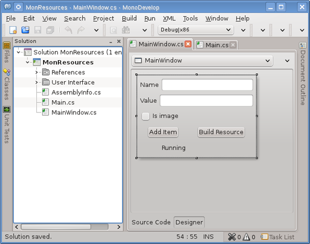
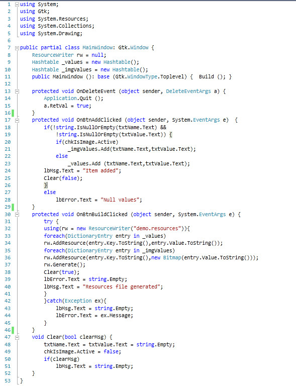
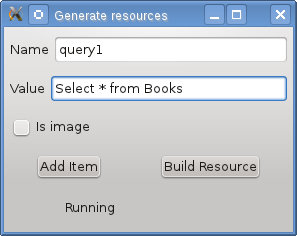
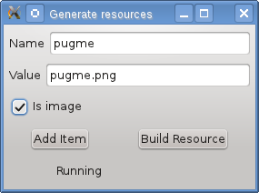
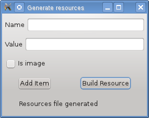
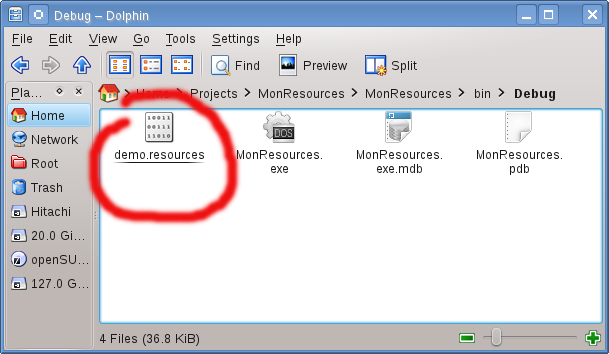
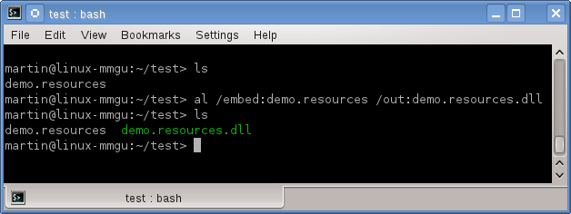
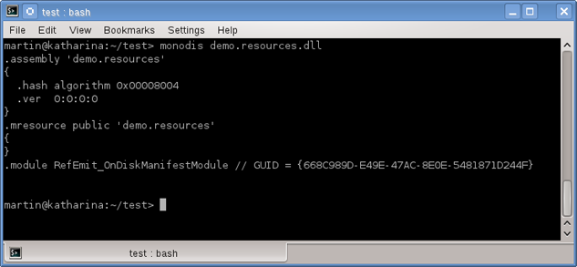

# Entendiendo Satellite Assemblies usando MonoDevelop - (parte 1)

			Una de las características más atractivas que .NET ofrece para el desarrollo de software es la capacidad de crear componentes en diferentes lenguajes de programación, esto es posible por que el objetivo de cada compilador existente para .NET es producir un assembly (ensamblado) el cual por definición es: La unidad funcional de distribución, versionamiento y de identidad de la plataforma .NET. 
			Además de clasificar los assemblies en Strong-Named o privados dependiendo de su instalación o en Single-File y Multi-File si contienen un archivo o varios, pueden también clasificarse en base a su contenido en donde tenemos a los ensamblados que contienen código MSIL y recursos (imágenes, traducciones o archivos de texto, etc) y a los Satellite assemblies (ensamblados satélite) que únicamente contienen recursos. 
			Para estos últimos ensamblados existen herramientas como Visual Studio o SharpDevelop que nos permiten hacerlo de forma automática, aunque también existe la opción de hacerlo de forma programática con las clases contenidas en el namespace <i>System.Resources.</i>

			<ul>
			<li><b>ResourceManager:</b> Permite tener acceso a los archivos de recursos de forma programática.</li>
			<li><b>ResourceReader:</b> Lee los archivos binarios de recursos.</li>
			<li><b>ResourceWriter:</b> Escribe los archivos binarios de recursos.</li>
			<li><b>ResXResourceReader:</b> Lee los archivos XML de recursos.</li>
			<li><b>ResXResourceWriter:</b> Escribe los archivos XML de recursos.</li>
			</ul>
			

			En el siguiente programa mostramos el uso de la clase <a href="http://msdn.microsoft.com/en-us/library/system.resources.resourcewriter.aspx">ResourceWriter</a> para crear un satellite asembly. Abrimos MonoDevelop y creamos una solución GTK#, utilizando el diseñador de la interfaz gráfica, creamos una GUI similar a como se muestra en la siguiente imagen:
			
 
			

				
            

			

			Construimos un manejador de evento para cada uno de los botones de manera que el código de la clase se vea como en el siguiente listado.
			

			<!-- Code -->
			

				
            

			<!-- Code -->
			

			Al compilar y ejecutar el programa podemos ingresar uno a uno el nombre y el valor de la cadena o del archivo de imagen que contendrá nuestro archivo de recursos, en caso de las imágenes debemos habilitar el checkbox “Is image” además de que el archivo de imagen debe encontrarse físicamente en el mismo directorio que el programa, en las siguientes imágenes introduciremos un par de valores de prueba.
			
 
			

				
            

			 
			

				
            

             
			
Después de ingresar el par de valores podemos generar físicamente el archivo de recursos con el botón <i>“Build Resource”</i>, como en la siguiente imagen: 
			

				
            

			  La funcionalidad del botón <i>“Build Resource”</i> es crear una instancia de la clase <i>ResourceWriter</i>. 
			<pre>
			rw = new ResourceWriter("demo.resources")
			</pre>
			Para después iterar en los valores de cada Hashtable,primero en el Hashtable de las cadenas en la cual utilizara el siguientel metodo:
 <pre> rw.AddResource(entry.Key.ToString(),entry.Value.ToString()); 
			</pre>
			

			A continuación itera en el Hastable de las imágenes en donde utiliza el método anterior salvo con la diferencia de convertir el valor en un objeto <a href="http://msdn.microsoft.com/en-us/library/system.drawing.bitmap.aspx">Bitmap.</a> 
			<pre>
			rw.AddResource(entry.Key.ToString(),new Bitmap(entry.Value.ToString()));
			</pre>
			 Por último se utiliza el siguiente método: 
			<pre>
			rw.Generate();
			</pre>
			Para crear físicamente el archivo “demo.resources” el cuál se creará en el mismo directorio donde se ejecuta el programa, como en la siguiente imagen:
			

			

				
            

			

			Ahora solo falta crear el Satellite Assembly, esto puede lograrse con el compilador de .NET o bien con el <tt>Assembly Linker</tt>, para este tutorial utilizaremos el <tt>Assembly Linker</tt>, la instrucción para crear el ensamblado es la siguiente:
			

			<pre>
			$ al /embed:demo.resources /out:demo.resources.dll
			</pre>
            

			Utilizamos la opción <tt>/embed</tt> para incrustar el recurso en el ensamblado y la opción /out para nombrar al ensamblado resultado, este comando lo ejecutamos desde una terminal de consola como en la siguiente imagen:

			

				
            

			

			Podemos observar que ahora el archivo <i>mono.resources.dll</i> es un ensamblado .NET válido  mediante la herramienta MonoDis mediante el comando:
			

			<pre>
			$ monodis mono.resources.dll
			</pre>
			

			Veremos el contenido del ensamblado, como se muestra en la siguiente imagen:
			
 
			

				
            

			

			Ahora ya tenemos listo el Satellite Assembly para que sea consumido por cualquier otra aplicación en .NET en la segunda parte mostraremos una aplicación para acceder al contenido del ensamblado.